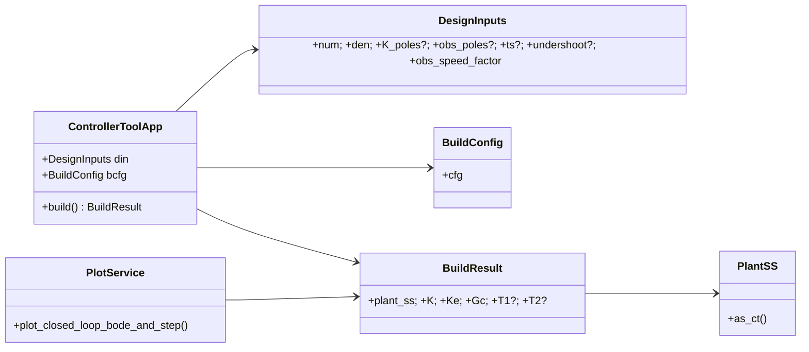

# stateSpaceDesign.controllerTool — Controllers with Observers (Ogata Sec. 10-7)

**CLI entrypoint**
```bash
python -m stateSpaceDesign.controllerTool.cli [OPTIONS]
```

**I/O**
- Inputs (if any): `stateSpaceDesign/controllerTool/in/`
- Outputs: `stateSpaceDesign/controllerTool/out/`

## Help
```bash
python -m stateSpaceDesign.controllerTool.cli --help
```

## Ready-to-run snippets (from repo root)

### 1) Ogata Sec. 10-7 example (plant 1/(s(s^2+1)); poles −1±j, −8; observer −4, −4)
**Matplotlib**
```bash
python -m stateSpaceDesign.controllerTool.cli --num "1" --den "1 0 1 0"       --K_poles "-1+1j,-1-1j,-8" --obs_poles "-4,-4"       --cfg both --plots mpl --save_prefix "stateSpaceDesign/controllerTool/out/ogata_10_7"
```
**Plotly**
```bash
python -m stateSpaceDesign.controllerTool.cli --num "1" --den "1 0 1 0"       --K_poles "-1+1j,-1-1j,-8" --obs_poles "-4,-4"       --cfg both --plots plotly --save_prefix "stateSpaceDesign/controllerTool/out/ogata_10_7"
```

### 2) Only configuration 1 (series)
```bash
python -m stateSpaceDesign.controllerTool.cli --num "1" --den "1 0 1 0"       --K_poles "-1+1j,-1-1j,-8" --obs_poles "-4,-4"       --cfg cfg1 --plots mpl --save_prefix "stateSpaceDesign/controllerTool/out/cfg1"
```

### 3) Only configuration 2 (feedback with N)
```bash
python -m stateSpaceDesign.controllerTool.cli --num "1" --den "1 0 1 0"       --K_poles "-1+1j,-1-1j,-8" --obs_poles "-4,-4"       --cfg cfg2 --plots plotly --save_prefix "stateSpaceDesign/controllerTool/out/cfg2"
```

### 4) Your Sec. 10-6 plant carried into Sec. 10-7 flow
```bash
python -m stateSpaceDesign.controllerTool.cli --num "10 20" --den "1 10 24 0"       --K_poles "-1+2j,-1-2j,-5" --obs_poles "-4.5,-4.5"       --cfg both --plots both --save_prefix "stateSpaceDesign/controllerTool/out/sec10_6_port"
```

## Programmatic API
```python
from stateSpaceDesign.controllerTool.apis import run, RunRequest
resp = run(RunRequest(num="1", den="1 0 1 0",
                      K_poles="-1+1j,-1-1j,-8", obs_poles="-4,-4",
                      cfg="both"))
T1, T2 = resp.result.T1, resp.result.T2
```

## Tests
```bash
pytest stateSpaceDesign/controllerTool/tests -q
```

## Mermaid class diagram

